I’m taking Photography 1 this school year, and so far we’ve taken a lot of nature photography around our school. I’ve been taking a liking to it, so as a sort of new year’s resolution, I’ve decided to take it up on my own time. Just over two weeks ago, on the 15th, my mom and I headed up to **Upper Stevens Creek County Park - Canyon Trail Trailhead**, a place where my family and I frequently hike—but for the first time, I brought my camera along. Taking my camera that day was the best thing I could’ve done. It opened up my eyes to all the intricate details we forget in our times with nature, and how a camera serves as a sort of lens (no pun intended) in allowing us to relive those details.

This January, I went on two different hikes: one on the 15th, and one on the 29th. This post will just consist of some of the photos I took on those days, a little bit about the contents in them, etc. All of the photos on my blog are taken by me on my dedicated camera, the Canon EOS Rebel T6. They can all—including the additional ones not included—be found [here](https://drive.google.com/drive/folders/1wrpC5GEXPhW3HTZ3zCPfQwamb6Pj36_n?usp=sharing) and in higher resolution as well.

## January 15th | Upper Stevens Creek County Park - Canyon Trail Trailhead

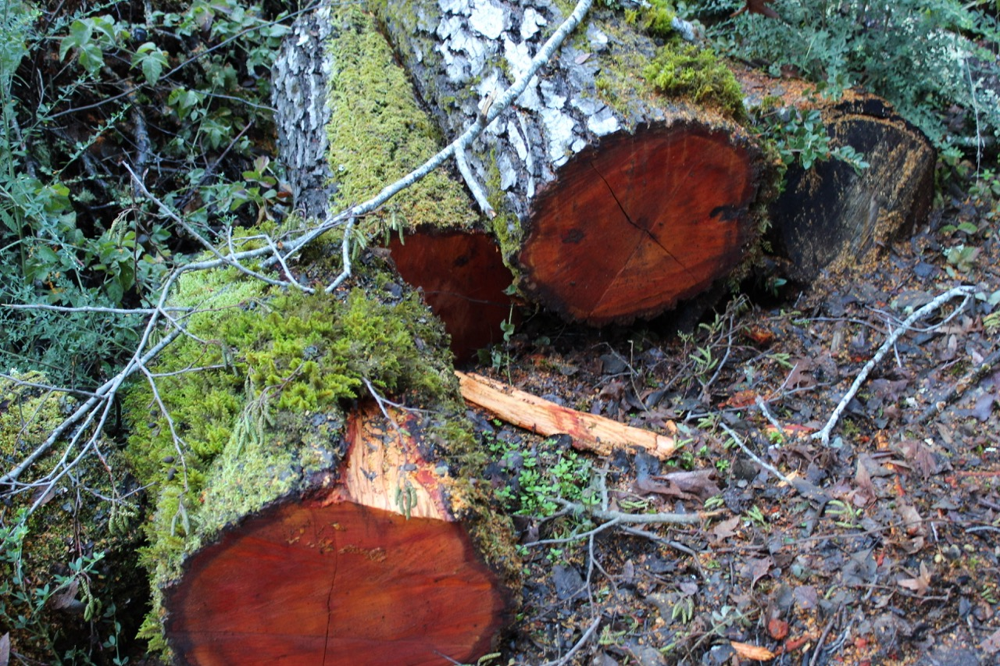

The moisture in this photo is obvious in part from the presence of moss, the dark ground, etc. However, there is one more major indicator of moisture that you might have not noticed as soon: the bright orange heartwood. The color of exposed heartwood allows for one to determine how much recent moisture there has been. In dry weather, exposed heartwood tends to be light beige. Recently, there has been a plethora of rain in the Bay Area, and that’s reflected in this bright orange, exposed heartwood. These tree slabs look like they are of **California Bay Laurel**, a native and abundant tree here in the Bay Area and elsewhere in California.  

What’s interesting about this photo is the bizarre street sign being overrun by nature as if it’s the Walking Dead and human civilization has disappeared for eternity. This used to be a road, I believe, before it got blocked off in order to serve as a hiking trail instead. The tree on the left is a **California Bay Laurel**. They thrive in these dense, wet California evergreen forests. 

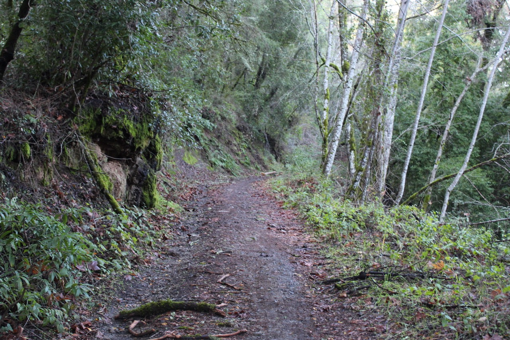

In this photo, there’s an interesting juxtaposition. There’s this random set of white, thin trees on the right that throw off this whole California brown, evergreen theme. The contrasting effect of these white trees might lead you to believe they are non-native—that they are **Birch** trees from the North East. However, these are not **Birch** trees, and they are not from the North East. I’m not sure exactly what type of tree they are, but their white bark seems deceptive in that it’s not truly white—you can scrape away at it quite easily to reveal a brown bark.

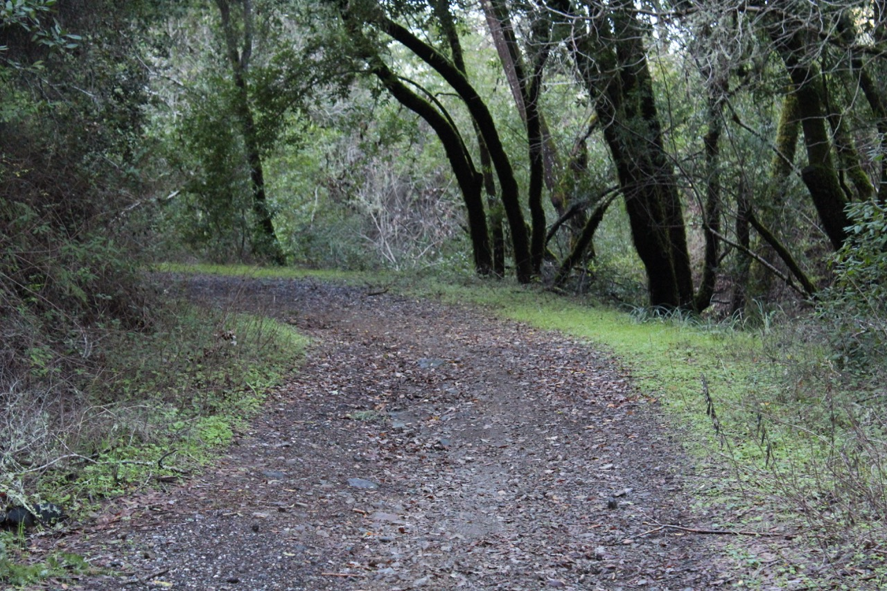

In this photo, you can see some very dark trees. The dark appearance of these trees, though, is actually attributed to the moss on their trunks. These trees are again **California Bay Laurel** trees, and they often grow with many thinner stems as opposed to a singular thicker trunk, as you can see.

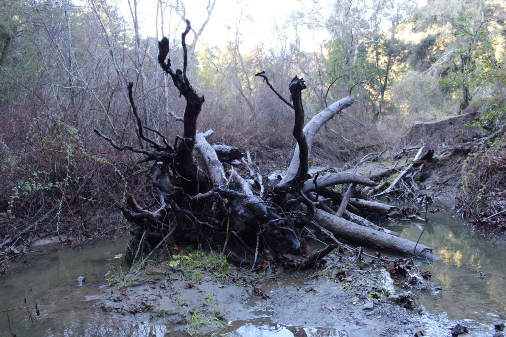

This photo is one of my favorites. It looks like it was taken straight out of a haunted forest. I’m not certain whether the collection of logs and branches seen in the middle was artificially placed or naturally arisen. Though, I think it naturally arose; it just so happens that all the other logs and branches that don’t end up on this elevated platform and end up in the water get swept away, leaving this beautiful centered conglomeration of wood.

This natural bridge, as you can see, was too scenic for me to not take a picture of. In fact, I even walked across it and I can affirm that it was indeed sturdy. 

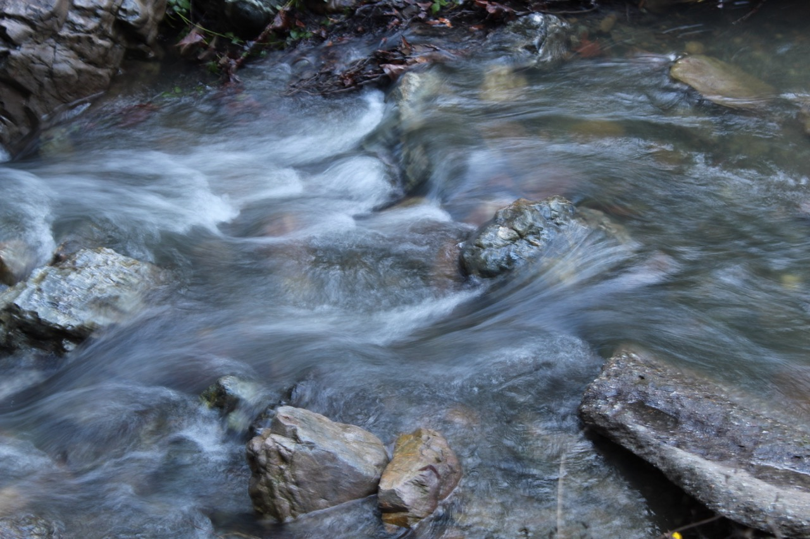

In Photography 1, we learned about shutter speed and how they can be manipulated to make long exposures. This was my attempt at that, and I can say that it’s not half bad. In fact, this was actually done hand-held. Taking this photo made me ponder why rocks always seem to be clustered at creeks and not elsewhere in the forests. It’s simple: the creeks just expose the rocks from the sediments covering them. Rocks are actually everywhere.

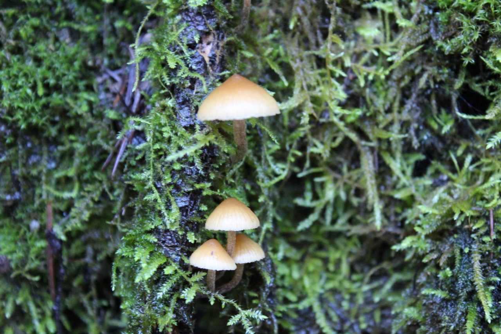

The presence of mushrooms here, especially on the tree bark, indicates a substantial amount of moisture. Fungi have an integral role in the ecosystem, and are an indicator of healthy, nutrient-rich soil and trees.

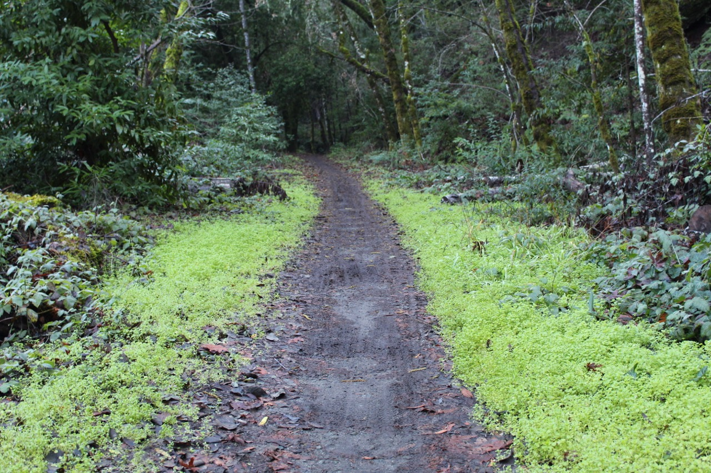

The contrast between the light green plants and the dark pathway was just too pretty for me to not take a picture of. What’s interesting about this is that it shows that the rain period is relatively recent. Yes, the ground is wet, but the growing plants on the side are recent sprouts. As it continues to rain, they will grow taller and it won’t look like this anymore.

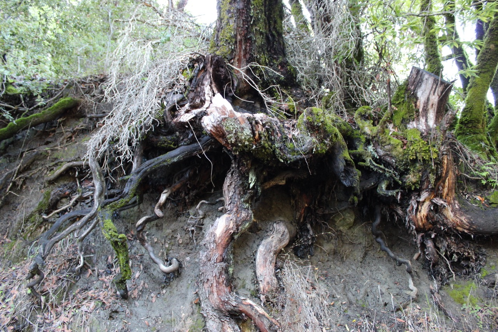

Not many times can one see the interesting root structure of a tree. This is one of those times. The foundation for this tree likely suffered a mudslide, which in turn exposed the tree’s root system. No tree could arise like this naturally. This root structure here highlights the many integral, but intricate parts of trees.

## January 29th | Monte Bello Open Space Preserve

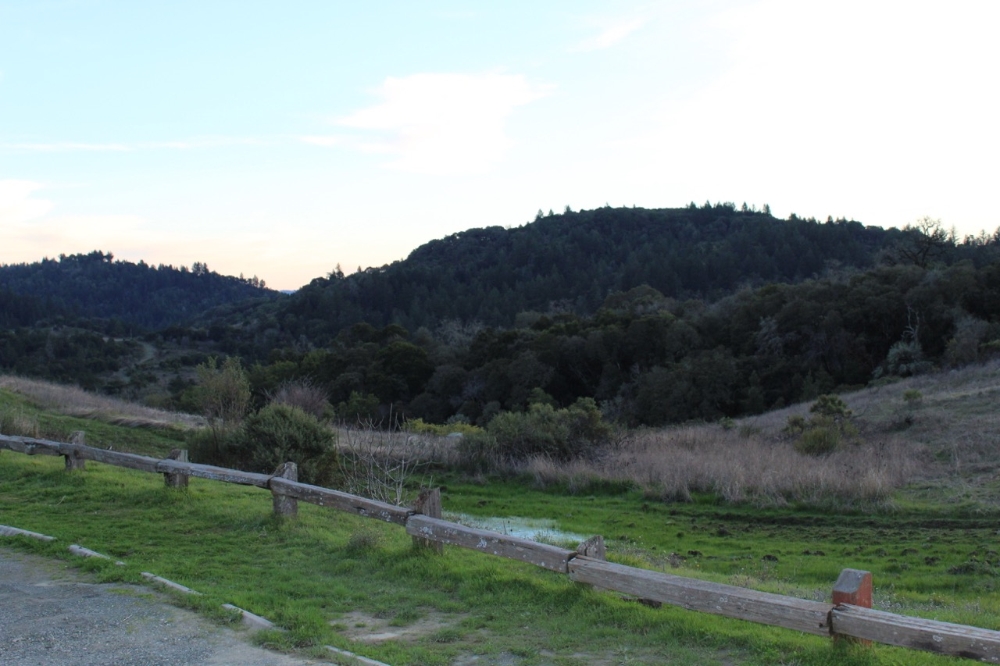

As opposed to the previous hike, this hike is much more open despite it being only a few miles away. This photo reflects that. You can also tell that the rainfall in the landscape isn’t prolonged yet. The immediate sprouts are green, but the existing grass is still yellow. It will take some time before it turns green as well.

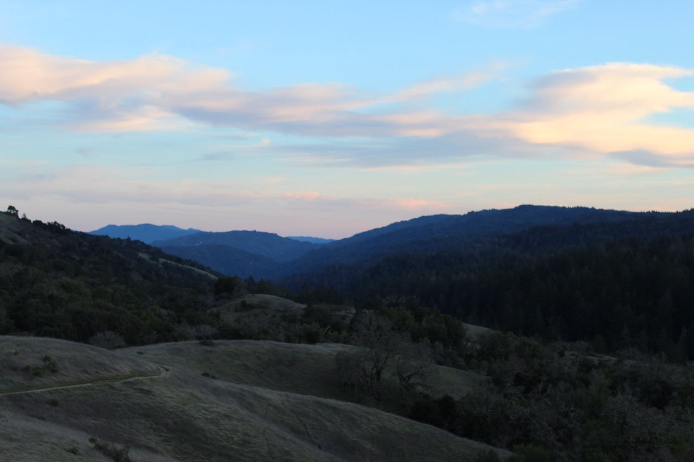

This photo is quite dark, but I feel like it really highlights the blue mountains in the background. You can’t really get that hue of blue in any other lighting. With the little bit of light that there is, you can also see the vast change in landscape from the oak savannahs to the dense evergreen forests (at which the previous hike took place). 

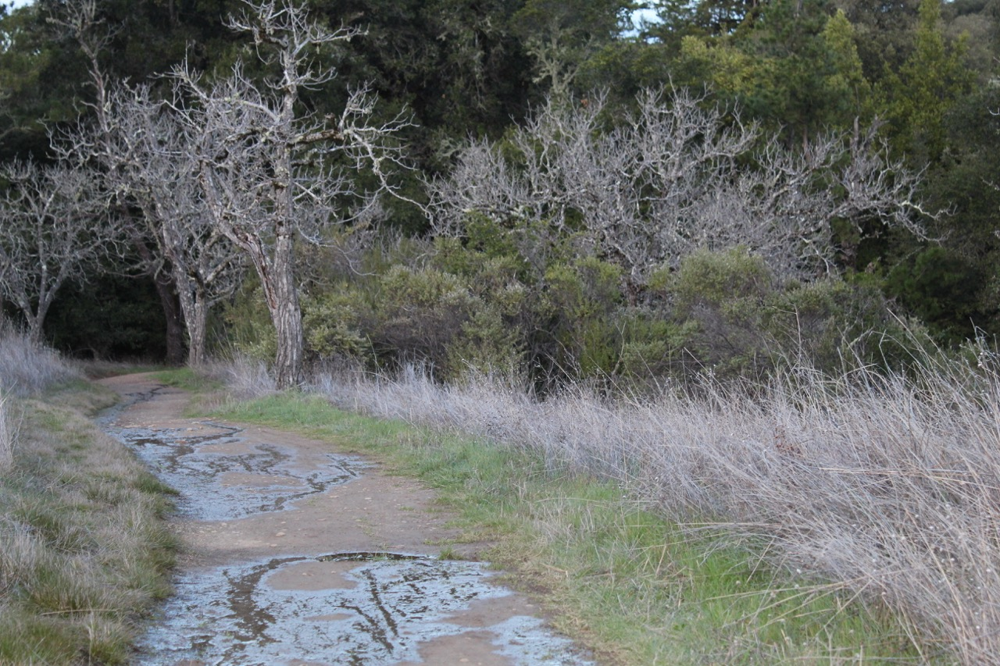

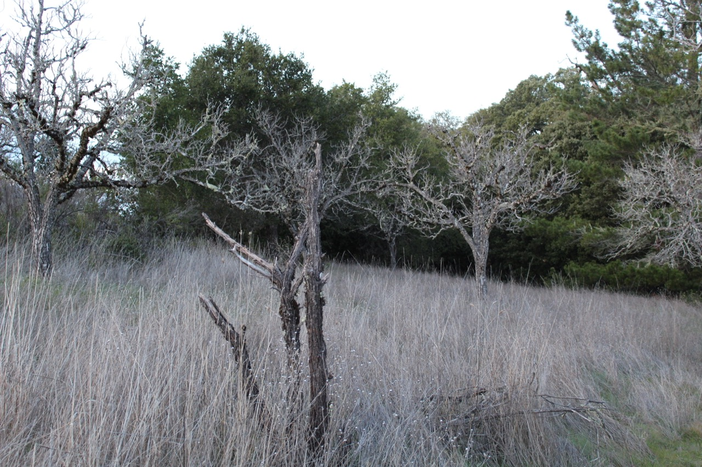

There’s an intriguing juxtaposition here in these two photos: bare trees in an evergreen landscape. Unlike with the last hike and the odd white trees, these bare trees are actually non-native. They were planted here by humans. They are actually deciduous **Persian Walnut** trees native to central Asia, which is why they’re bare at this time in winter.

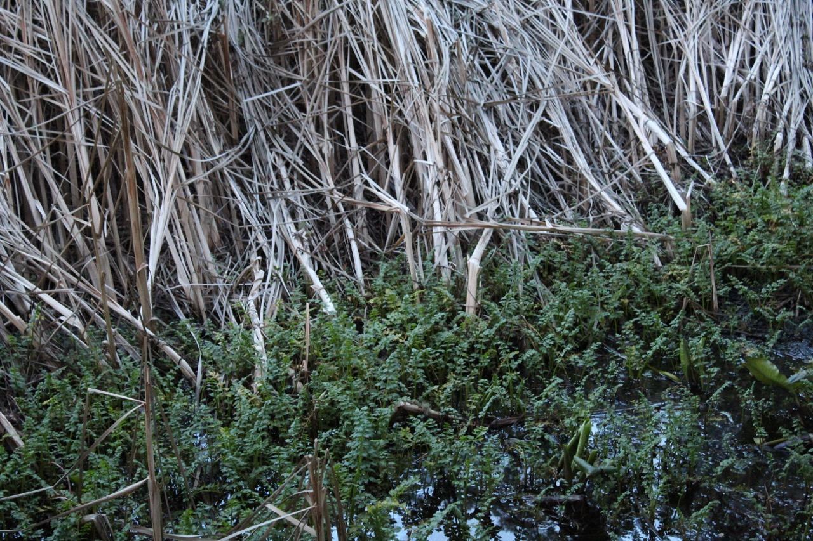

You might be questioning where this photo takes place due to the juxtaposition between the dead and living plants. This is actually a swamp. The dead plants, I believe, are of the **Schoenoplectus** family, a familial species that grows in marshy conditions. I’m not entirely sure what the species of the green, living plants are.

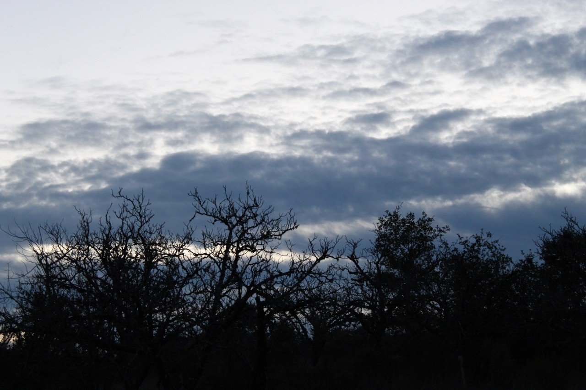

This photo is one of my favorites. It’s generally against custom to take photos like this in the dark, but it was just too scenic for me not to. This is one of those rare moments where in the dark, the photo turns out better than how the eye sees it. 

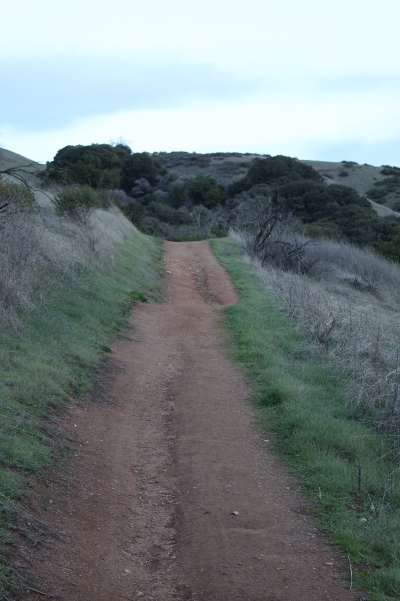

For this photo, I decided to be a bit more unconventional than I have been with my previous photos in a different way: rotating the camera. This vertical perspective better highlights the pathway. The newfound, green grass on the side but the old yellow grass further out also shows that the rainfall is only recent, and it needs to continue before the whole scenery transforms into a green landscape.
