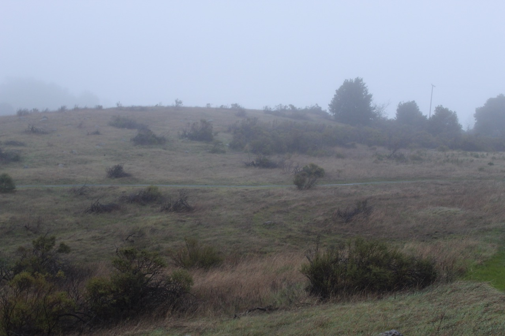
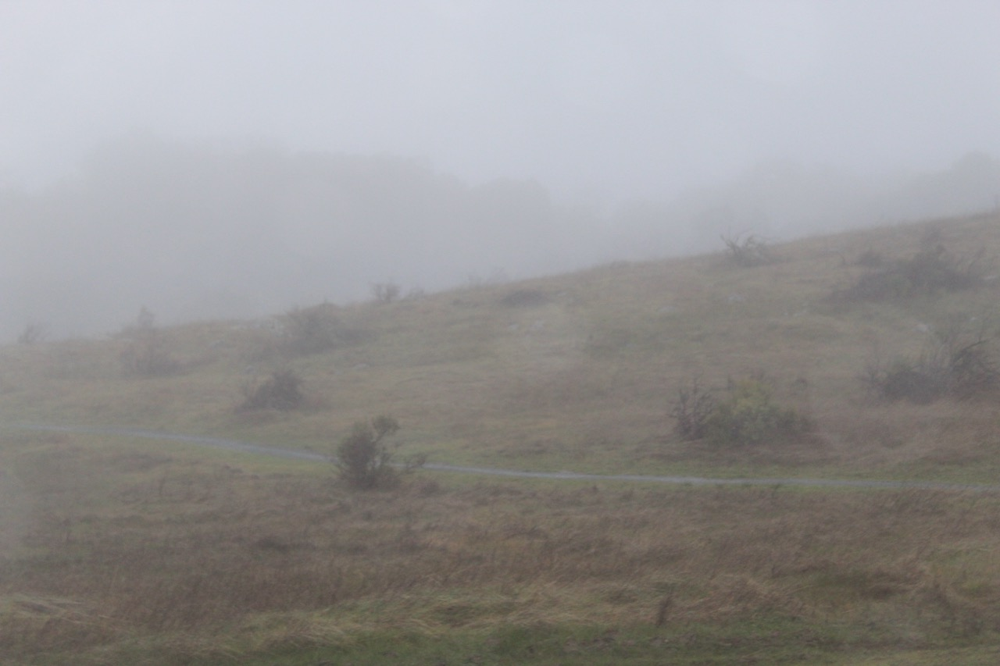
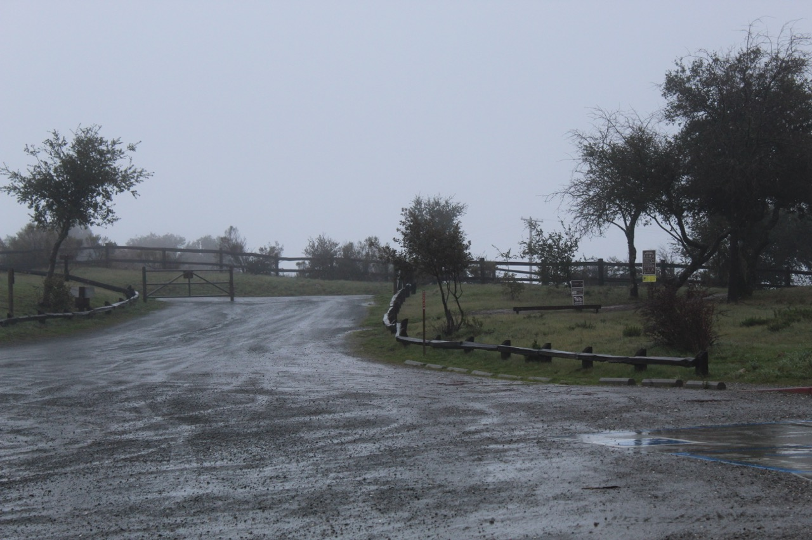
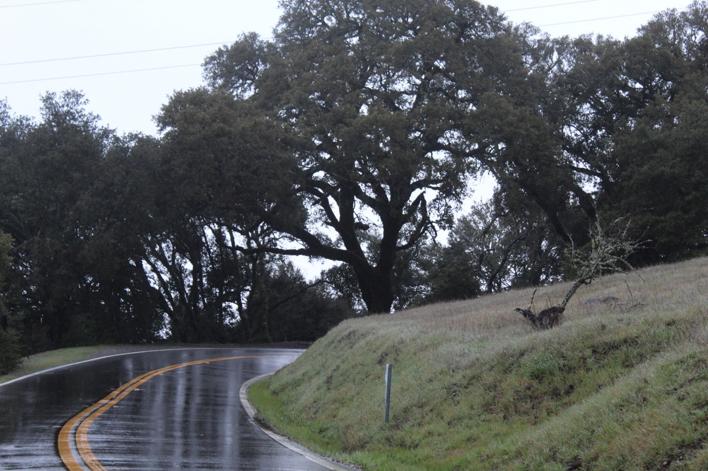
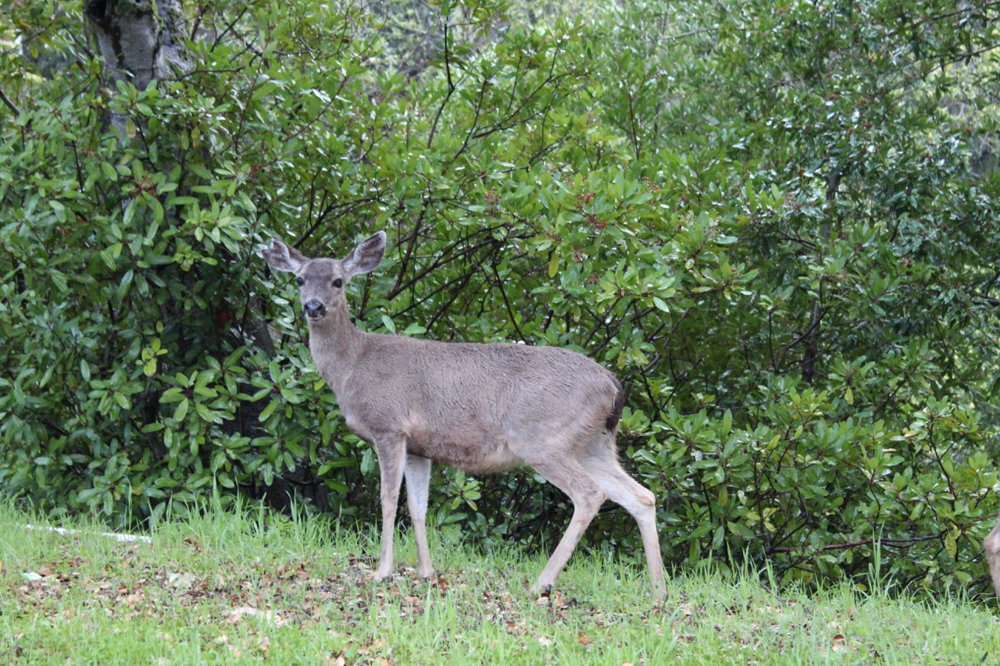
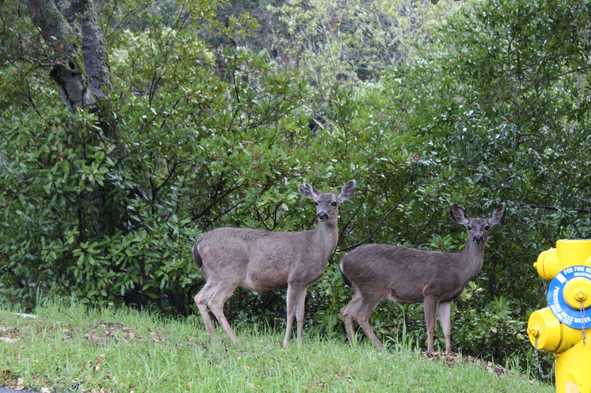

In last month’s post, I talked about how the rain in January wasn’t prolonged enough to have a visible impact on the landscape, specifically the **Monte Bello Open Space Preserve** landscape. This February was especially rainy—more rainy than January. So, I wanted to see if this month’s rain would be the tipping point in finally getting the landscape of the preserve to change.

Today is the last day of February, and guys, when I tell you how rainy and windy it was when I took the photos I'm about to show, I mean it felt like the weather had a vendetta against the landscape. Let’s just say that the relentless drenching left no stone unturned. Nevertheless, I still managed to shoot some pretty good photos despite the conditions.

## February 29th | Monte Bello Open Space Preserve

In these photos, the grass may still seem yellow like it was in last month’s post. However, looking more closely, you can see faint streaks of green all throughout it. This transformation of the grass is actually quite unique to see. Grass transforms quickly. It only needs some sunlight after an adequate amount of rain (depending on how dry it was) in order to go from yellow to green in what’s generally described as an immediate transformation. The adequate amount of rain starts this transformation (in this case, two months of it was needed, with an emphasis on the second month), but the lack of sunlight prolongs it. This February was not particularly sunny at all, which is why I was able to capture the transformation of this grass in its prolongation.

This photo shows the parking lot of **Monte Bello Open Space Preserve**. As you can see, the weather and the fact that it’s a weekday has deterred a lot of people away from hiking at this time of day. As well, it may seem that grass is much greener here than it is in the previous two photos, but rest assured, it only appears that way because of the lighting subject to the camera in this particular instance. In real life, the grass is much yellower and has the same streaks of green described in the previous two photos.

This picture was taken on the roadside of **Monte Bello Open Space Preserve** as indicated by the road, and it really strikes a chord with me. The overall composition of the photo is varied, but well-balanced. The bottom right corner, consisting of an elevated hill, acts as a bulwark, guiding the viewer to the bottom left corner, the road. The road provides two passages to a beautifully centered oak tree in the upper middle half of the photo: the first one being the actual road itself, but the second one being the reflection it provides. Nevertheless, this photo also reflects the changing landscape: green new grass ridged between old yellow grass. In this case, it’s a little more prominent than in the first two photos.

Also along the roadside of the **Monte Bello Open Space Preserve**, I noticed a deer. Then, another one of his or her buddies showed up. These deer most likely belong to the **Columbian Black-tailed deer** species because they literally have a black tail and because this species of deer is really the only one that exists in the Bay Area. What’s unique about the second photo is that the second deer (the one on the right) seems to have a mild case of **melanism**, which in case you don’t know, is a rare genetic trait characterized by the darkening of pigmentation in animals including deer.

> Initially thought to be an independent species, Black-tailed deer are confirmed to be a subspecies to the Mule Deer. There are many subspecies of Black-tailed deer too. The Colubmian Black-tailed deer and the Sitka Black-tailed deer both live along the western coast of North America, but the Colubmian Black-tail deers' ranges expand further south—all the way to Santa Barbara County[^footnote]
{: .prompt-tip }

## Photo Credit and Information

All of the photos on my blog are taken by me on my dedicated camera, the Canon EOS Rebel T6. They can all—including the additional ones not included—be found [here](https://drive.google.com/drive/folders/1wrpC5GEXPhW3HTZ3zCPfQwamb6Pj36_n?usp=sharing) and in higher resolution as well.

## Footnotes

[^footnote]: [Black-tailed deer - Wikipedia](https://en.wikipedia.org/wiki/Black-tailed_deer)
