As a native Bay Arean, I had the wonderful experience of visiting the East Coast for the first time last week. In particular, I visited the Research Triangle Park (RTP) area in North Carolina, which consists of Durham, Raleigh, and Chapel Hill. Fun fact for all the nerds: the reason why it’s called Research Triangle Park is because of the three highly regarded educational and research facilities of Duke University, UNC Chapel Hill, and NC State University situated in those cities respectively, which have geographical positions that form a triangle.

Stepping out of RDU International Airport at night was a surreal moment for me. It was a humid eighty-four degrees, and I was sweating more profusely than I anticipated. I had never experienced weather like this. This fascinated me, and was my inspiration for this research into the myriad differences between the two vastly different climates. I did this specifically by documenting the vegetation through photos that I took.

## RTP’s Climate

Like a lot of the Eastern states, North Carolina’s climate is humid subtropical. Since there isn’t much of a variety between climates in the East let alone in individual states, like North Carolina, we can classify the climate of RTP as humid subtropical as well.

Some features of the humid subtropical climate include:
- Hot humid summers
- Mild winters
- Evenly distributed precipitation
- High humidity
- Long growing season
- Lush vegetation

## The Bay Area’s Climate

California has many vastly different climates. Coastal California (from Marin County and downwards), which includes the Bay Area, has a climate described as being Mediterranean.

Some features of Mediterranean climate include:
- Hot, dry summers
- Mild, wet winters
- Distinct season contrast
- Drought-resistant vegetation
- High biodiversity
- Frequent wildfires
- Moderate coastal influences

## Intricate Differences

### Vegetation closer in-land:

#### Bay Area Mixed-Evergreen Forests:
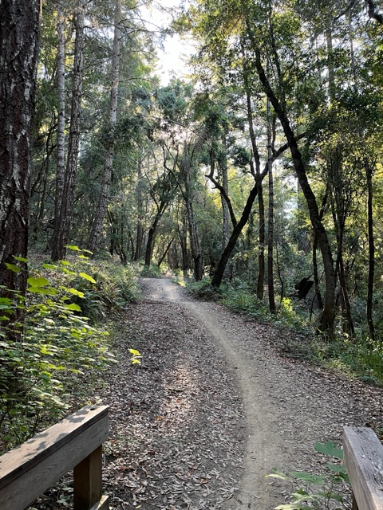
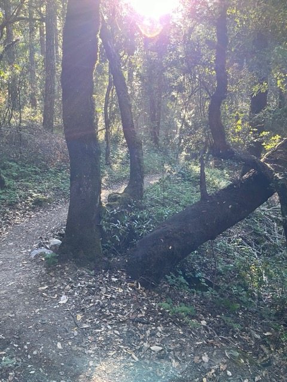
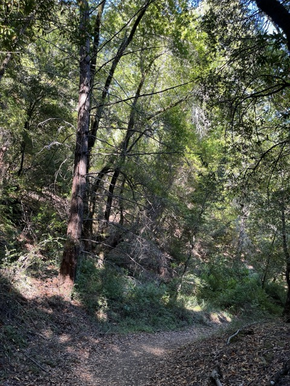
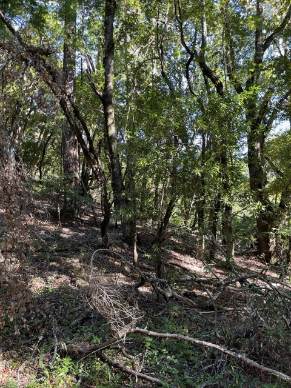
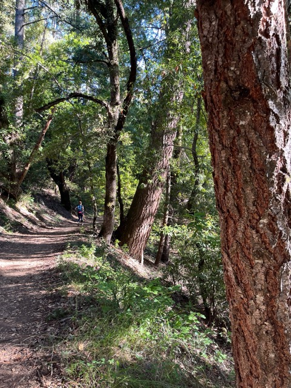

**Key observations:**
- Dark, winding, more moss-covered tree trunks
- Stocky, short trees
- Darker green leaves
- Darker soil
- An overall brownish tint to the forest
- A lot of shrubs and underbrush

**Conclusion:**
The dark, winding, moss-covered tree trunks and stocky, short trees are adaptations to the region's summer droughts and mild, wet winters—and help conserve water and withstand periodic droughts. The darker green leaves and darker soil allow for maximizing photosynthesis and nutrient retention in these nutrient-poor soils that are common in these Mediterranean climates. The overall brownish tint and abundant shrubs and underbrush are adaptations to the frequent wildfires of these ecosystems; the shrubs act as a fire-adapted species in order to promote rapid regeneration after fires.

#### RTP Oak-Hickory Forests:
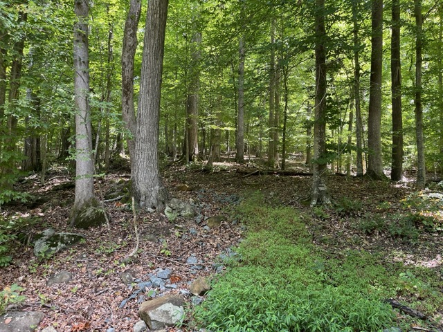
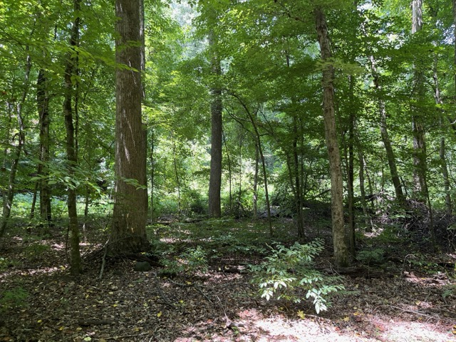
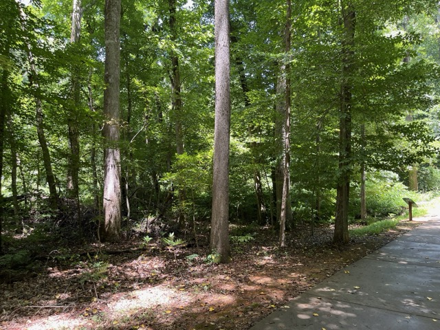
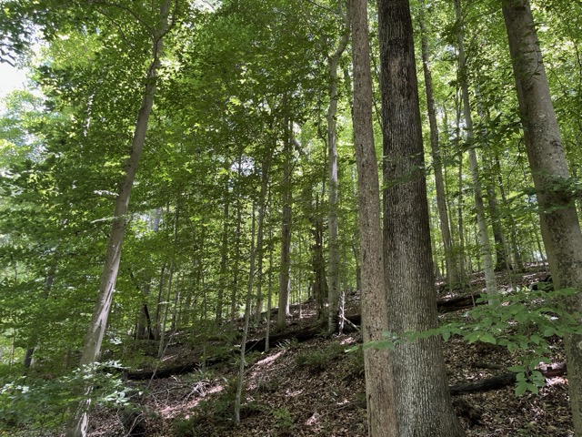
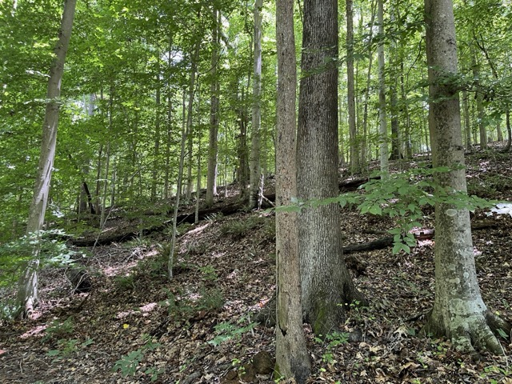
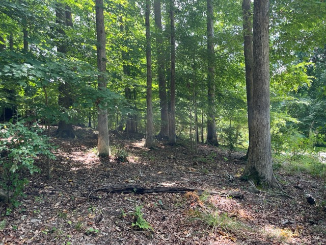
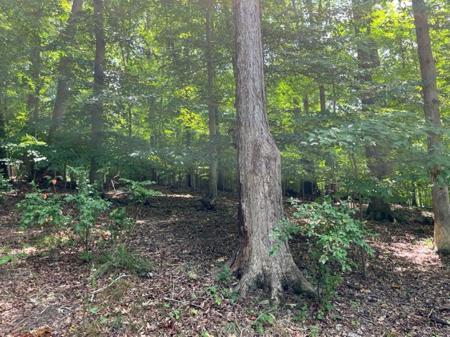

**Key observations:**
- Lighter, straight, bare tree trunks
- Taller, upright trees
- Lighter green leaves
- Lighter soil
- An overall light green tint to the forest
- A lack of shrubs and underbrush

**Conclusion:**
Lighter, straight, bare tree trunks and taller, upright trees are the adaptations needed to maximize light exposure in the densely forested environment of more in-land RTP. Lighter green leaves and lighter soils are the adaptations for higher precipitation and nutrient availability that are generally typical in humid subtropical climates closer in-land. The overall light green tint and minimal shrubs or underbrush are the adaptations for a less fire-prone environment compared to Mediterranean climates, which also allow for greater tree growth and canopy development over time.

### Vegetation closer to the coast:

#### Bay Area Oak Woodlands/Savannahs:
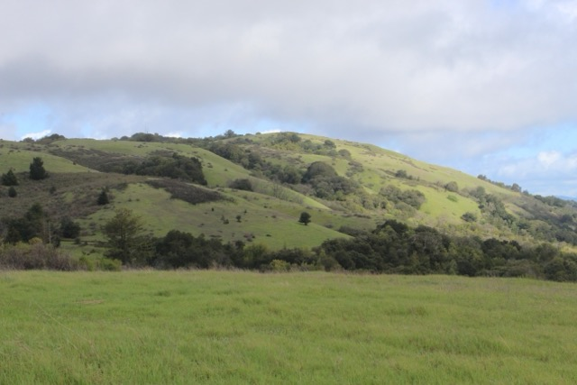
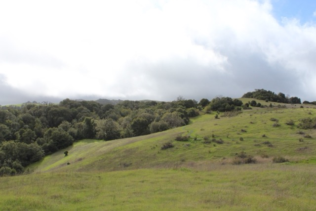
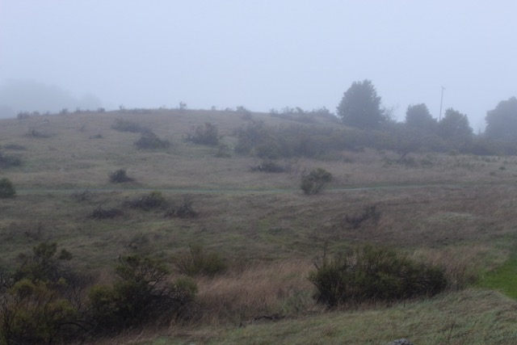
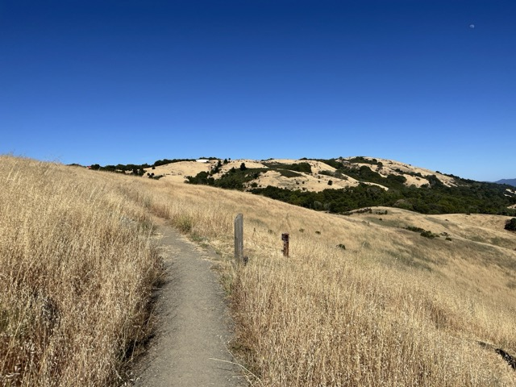

**Key observations:**
- Less conglomeration of trees
- Lack of tree variety; Coast Live Oak being predominant tree
- Even stockier, shorter, thicker, and bushier trees
- Leaves remain dark green, but waxy
- Trunks are bare, but remain relatively dark
- Lighter soil
- Grasslands
- Less underbrush

**Conclusion:**
The sparse conglomeration of trees, which comprises Coast Live Oak, and their stockier, shorter, and bushier forms are adaptations to summer droughts and periodic fires. The dark green, waxy leaves and relatively dark trunks are the adaptations for water conservation and resilience to coastal fog. Lighter soils and extensive grasslands are the adaptations to nutrient-poor, well-drained soils and frequent wildfire events that shape these open woodland ecosystems. The lack of dense underbrush is an adaptation that promotes fire resistance, encouraging the dominance of the fire-adapted Coast Live Oak species.

#### RTP Pine Woodlands:
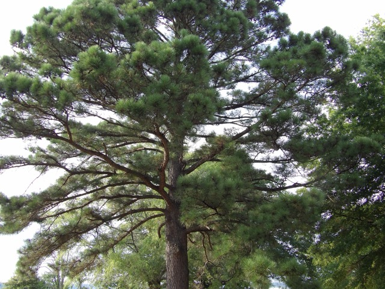
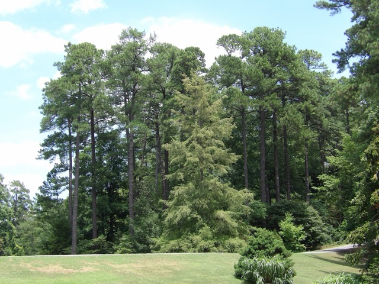
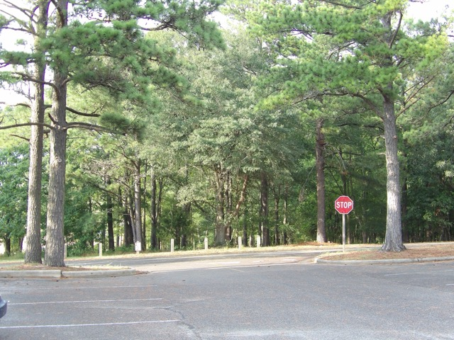
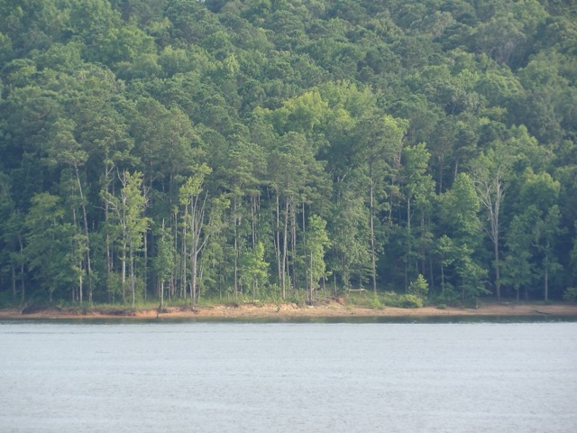

**Key observations:**
- Higher conglomeration of trees
- Lack of tree variety; Longleaf Pine being predominant tree
- Taller and lankier trees
- Trunks remain bare, but are darker
- Darker soil
- Leaves (that being pine needles) are darker and waxy
- More underbrush

**Conclusion:**
Higher tree density, all dominated by Longleaf Pine, and lankier tree forms are the adaptations to the region's frequent rainfall and warmer temperatures. Darker, waxy pine needles and darker soils are the adaptations for maximizing nutrient uptake and water retention in the wetter environment, similar to the Bay Area’s more coastal climate. The darker, wetter soil supports biodiversity and ecosystem resilience, with these species adapted to fire regimes that historically shaped southeastern pine forests. This fire resilience is also seen in the Bay Area’s more coastal climate as well.

## Photo Disclaimer

All photos in not just this blog post, but in all blog posts, are taken by me. If you would like to see my additional photos that are also in higher quality than in the blog posts, you can [click here](https://drive.google.com/drive/folders/1wrpC5GEXPhW3HTZ3zCPfQwamb6Pj36_n?usp=sharing).

