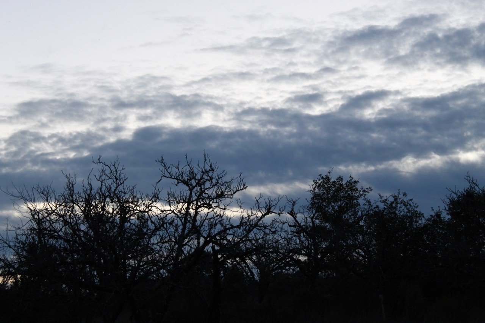
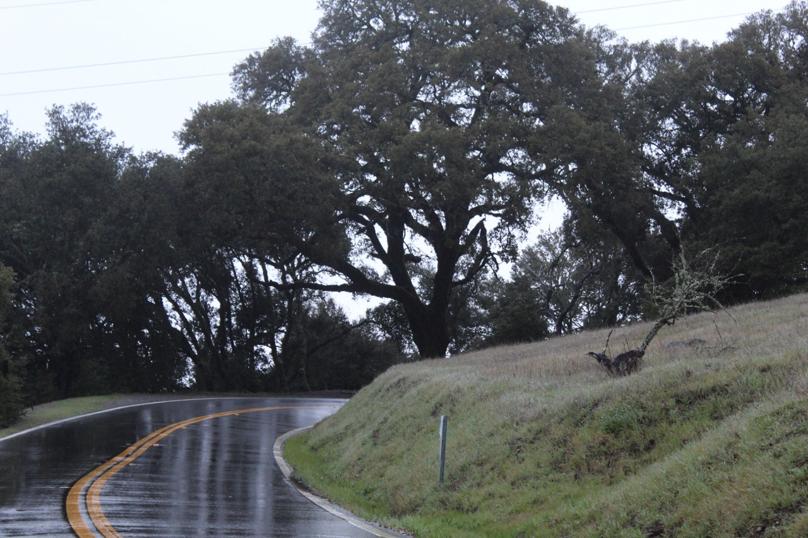
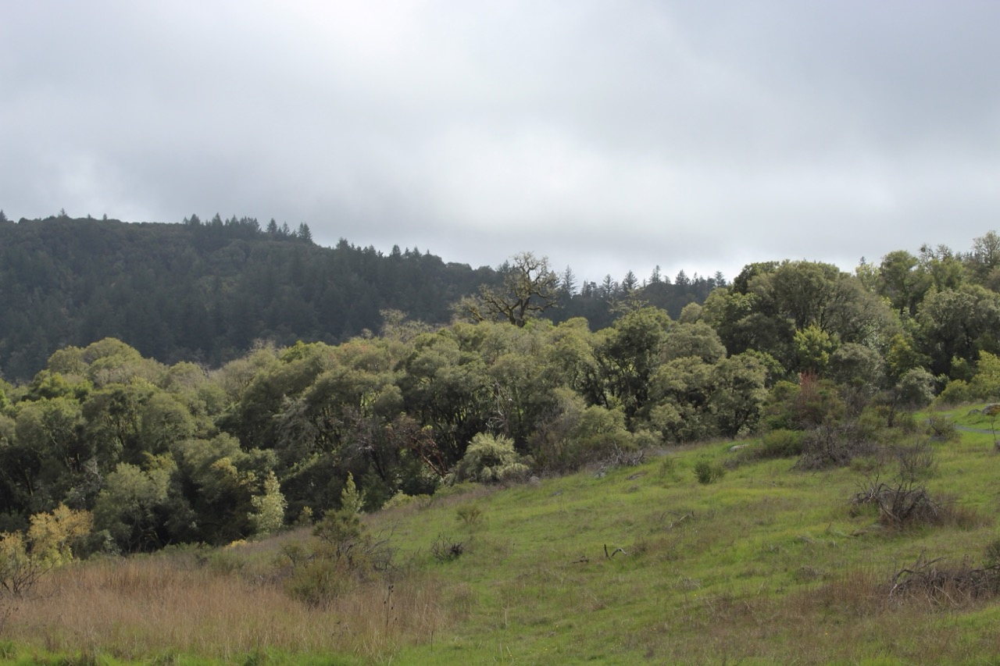
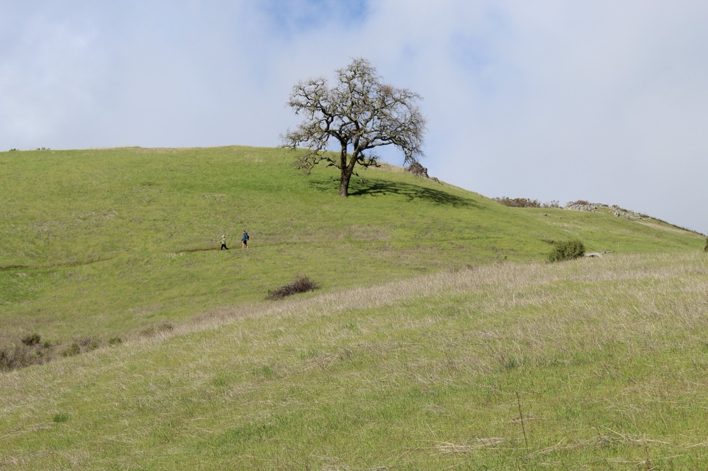

I’m turning 18 tomorrow, and I haven’t decided how to feel about it yet. On one hand, I’m excited about the opportunities that being an adult will present, but on the other hand, I’m nervous about the challenges that will come along the way. But I know that as an adult, I have the power to make a positive impact—and I want to do so through environmental protection. I’ve come a long way since starting this blog in January. I figured out how photographing nature and discussing was my medium of environmental protection, and hopefully, I’ve helped in your journey to finding yours. So, without further ado, I want to dedicate this post to some of my favorite nature photographs I’ve taken in the past year to appreciate how far we’ve come along.

## January 29th | Monte Bello Open Space Preserve

It’s generally against custom to take photos like this in the dark, but it was just too scenic for me not to. This is one of those rare moments where in the dark, the photo turns out better than how the eye sees it. What I believe makes this photo so captivating is the interplay of different photography elements, specifically **tone** and **space**. In this photo, the sky provides space; it serves to add scale and reflects the vastness of Earth beyond the vegetation on the ground that we normally associate it with. The tone, created from the contrast between the shrubs and sky, really adds to this idea, specifically by reflecting the differences between Earth's natural components—and how they all work together to create the natural world we know today.

## February 29th | Monte Bello Open Space Preserve

This picture was taken on the roadside of Monte Bello Open Space Preserve as indicated by the road, and it really strikes a chord with me. The overall composition of the photo is varied but well-balanced. The bottom right corner, consisting of an elevated hill, acts as a bulwark, guiding the viewer to the bottom left corner, the road. The road provides two passages to a beautifully centered oak tree in the upper middle half of the photo: the first one is the actual road itself, but the second one is the reflection it provides. Nevertheless, this photo also reflects the changing landscape: green new grass is ridged between old and yellow grass. In this case, it’s a little more prominent than in the first two photos.

## March 24th | Monte Bello Open Space Preserve

What I love about the above photo is how it’s the natural embodiment of the photography concept layering. There are three distinct biomes all in proximity, highlighting just how prevalent California’s ecotones are. In the foreground, there are the grasslands. In the middle ground, there are the highly dense dry-oak woodlands. And in the background, there are mixed-evergreen forests characterized by more moisture and a good deal of coniferous trees.

This photo is also one of my favorites. The tiny hikers alongside the lone, bare oak tree really underscore the vastness of nature. The bareness of the tree may even be why this photo is so striking, but unfortunately, the tree is actually suffering from some disease that has caused it to lose all its foliage.

## June 16th | Monte Bello Open Space Preserve

This photo highlights how the sunny, mild, and dry weather of June is enough to dry out the grass but not enough to dry out the evergreen forests, thereby creating a beautiful, contrasting effect. The contrast between the forest-green trees, the golden-colored grass, and the vivid blue sky is why I like this photo so much. It’s interplayed with line, an element in photography that guides viewers across a photo. In this case, I believe line makes the viewer scrutinize each of the three natural features, emphasizing their differences.

What I like about my photo above is how simple yet powerful it is. The use of line divides it into two symmetrical halves: the sky and the grass. It evokes a feeling of balance that highlights the differences and similarities between the two halves, important factors we consider in trying to balance aspects of our own lives. For example, the sky and grass are both uniform in color but different in texture, similar in tone but distinct in pattern, and alike in unity but dissimilar in detail.

## Photo Credit and Information

All my nature photos not just in this blog post, but in all blog posts, are taken by me and can be found [here](https://drive.google.com/drive/folders/1wrpC5GEXPhW3HTZ3zCPfQwamb6Pj36_n?usp=sharing) and in higher quality as well. 

Once there, you'll find folders labeled by date, each containing photos taken on those specific days. The photos located in the folder up to and including the "4/28/24" folder were taken by me on my Canon Rebel EOS T6 until it unfortunately got lost. As a result, I reluctantly had to take the photos in the "6/16/24" folder on my iPhone 13 before getting a Kodak Pixpro AZ528 which I used to take the photos in the "7/5/24" folder before lucking finding my Canon Rebel EOS T6, using it to take the photos in the remaining folders. I try to not take my nature photos with my phone. To be connected to nature is to disconnect from the everyday distractions of life, and documenting that through a phone is paradoxical in itself because those very same phones are the facilitators of our distractions and our disconnection with nature.

