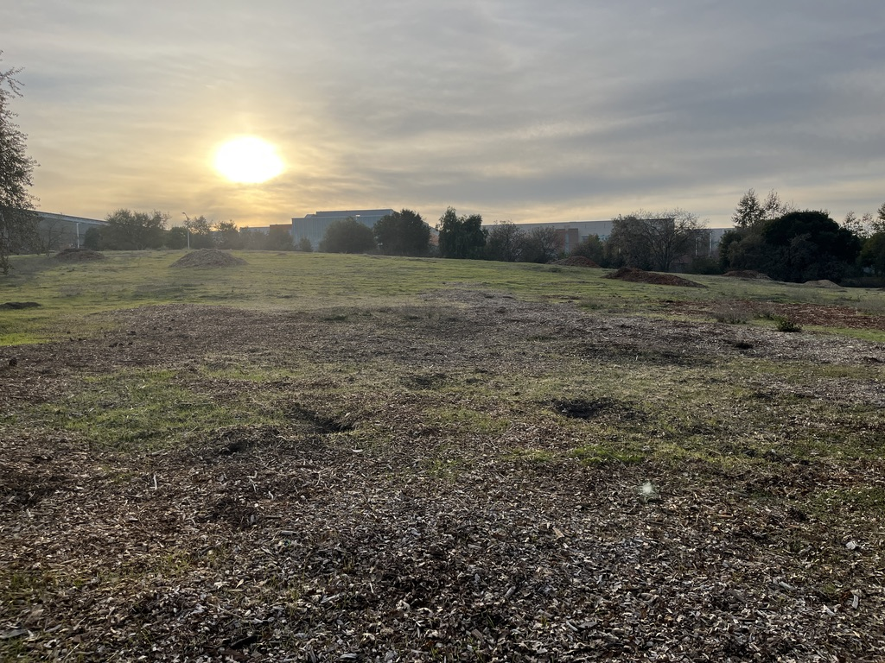

This post will be different from my others. Normally, I dedicate my posts to appreciating the beauty of nature through my photography, where I reflect on both the scientific and artistic elements of the photos. I frequently talk about the importance of environmental protection, but with the recent tragedy of the L.A. fires, I feel like it’s especially important for me to take the time to emphasize just how dire things will get if we don’t address the impacts of human-induced climate change now.  

When I first learned about the L.A. fires, I couldn’t believe it. California has had its fair share of devastating wildfires, but for it to have one that severe—and in winter of all times—was something I never thought was going to happen any time soon. But before I go on, I want to offer my condolences to those who have experienced loss in any way, shape, or form from the fires. It's difficult losing everything you know. I want to also thank all the firefighters who have and are still putting their lives on the line to stop the fires.  

There’s been a lot of discussion about the mismanagement of resources to aid in the fires, but what I see people failing to realize is the fires shouldn’t have ever happened in the first place. The winds shouldn’t have been blowing at 100 MPH, the vegetation shouldn’t have dried out from a lack of rain, and the fires certainly shouldn’t have occurred in the midst of winter.  

I find it ironic how we complain about the effects of climate change even though we continuously neglect the steps needed to take to prevent them. Scientists have been warning us about human-induced climate change since the 1950s, so there really is no excuse on our end. But who am I to berate society when I myself have been subject to this apathy? Indeed, I have found myself procrastinating on chores and homework at times despite knowing their importance in the same way that many procrastinate about taking steps to protect the environment despite knowing its importance. It is for this reason that I believe people are inherently good, which is why it’s one of my goals to help guide them to take action in protecting the environment now.  

## An Unusual Winter 

What puzzled me about the L.A. fires were the circumstances that allowed them to get so devastating in the first place, and I couldn’t help but notice that this entire winter itself was also just weird. There was no rain at all, and I noticed unprecedented levels of pollution—at least here in the Bay Area. The sky was noticeably hazy—so much so that I could hardly make out the surrounding mountains which one could easily do on an otherwise clear day.  

Below is a picture I took in December of the haze seen from my school.  

  

It was interesting to notice that the pollution didn't smell like smoke, which was weird because the only severe pollution we do get, if any, is in the form of soot/particulate matter caused by wildfires. Indeed, this was **smog**, a different type of pollution caused directly by human activities, such as factory emissions, vehicle exhausts, and coal power plants. I was determined to find the specific scientific reasoning for this occurrence, and I must say, my knowledge from **AP Environmental Science** really enabled me to do so. I’m so glad I took it this year.  

## The Scientific Explanation

What I’ve learned is the L.A. fires and the pollution here in the Bay Area have something in common: both were caused by unprecedented changes in wind. Because of rapidly rising global temperatures, California is seeing more and more **high-pressure systems**.  

These high-pressure systems occur in the winter, and when they are near the coast, they **weaken onshore winds by suppressing rising motion**. As a result, there is no wind that would normally blow away the pollution caused by all the human activity in the city. Additionally, the stagnant air allows for agricultural pollution in the Central Valley to seep in and add to the haze.[^footnote]

On the other hand, high-pressure systems were the reason why winds got so fast over in L.A. A high-pressure system over the Southwestern U.S. pushed air toward areas with low pressure. Because L.A. was in a low-pressure area, winds there got to exceptional speeds,[^fn-nth-2] resultantly fueling the fires to the point where no amount of human effort could do anything for a while.  

High-pressure systems are also a **major reason why winter has been dry** so far in California. They prevent air from rising, a process necessary for cloud formation and therefore rainfall.  

Just take a look at the image below, which was taken this January, and compare it to the photos in my first blog post that were taken last January, when there were little to no high-pressure systems. The differences in water saturation speak for themselves.  

 

## Steps We Can Take 

It may seem like everything will be fine now that an **atmospheric river** is on its way toward the Bay Area, but keep in mind that weather extremities don’t cancel each other out in a way where everything can just magically be solved. Even atmospheric rivers are known to cause flooding in the Central Valley.  

The point is that while our earth is resilient, there is only so much it can withstand. It’s important we do our part in ensuring we don’t harm the earth more than it’s already being harmed and, if possible, take action against the harm that’s being done to it.  

I feel like this is a realistic approach to getting the masses to help the environment. People have their own bills to pay, their own families to tend to, and can’t just drop everything they have to help the environment in a way that is expected from them by so many activists I see on social media.  

It’s sad to see so many people on social media being deterred from environmental protection to the point where they actually push back against it. I've seen it take hold of our younger generation through memes and other forms of internet culture, which is why I urge you guys to just **do what you can**—even if it's not much. 

You don’t have to give up on eating meat or buy a $30,000 electric car—just the smallest actions can go a long way.

## Footnotes

[^footnote]: [Here’s what is causing the Bay Area’s poor air quality - San Francisco Chronicle](https://www.sfchronicle.com/weather/article/air-quality-pollution-19960357.php)
[^fn-nth-2]: [Here's how climate change fueled the Los Angeles fires - NPR](https://www.npr.org/2025/01/29/nx-s1-5273676/la-fires-climate-change-rainfall-extreme-weather#:~:text=The%20Santa%20Ana%20winds%20blow,leading%20to%20dangerous%20fire%20conditions.)
