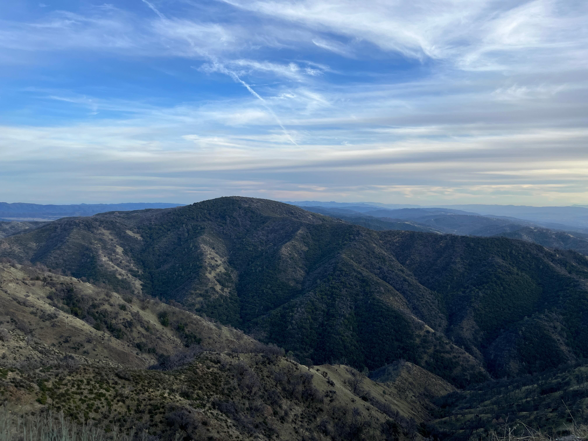
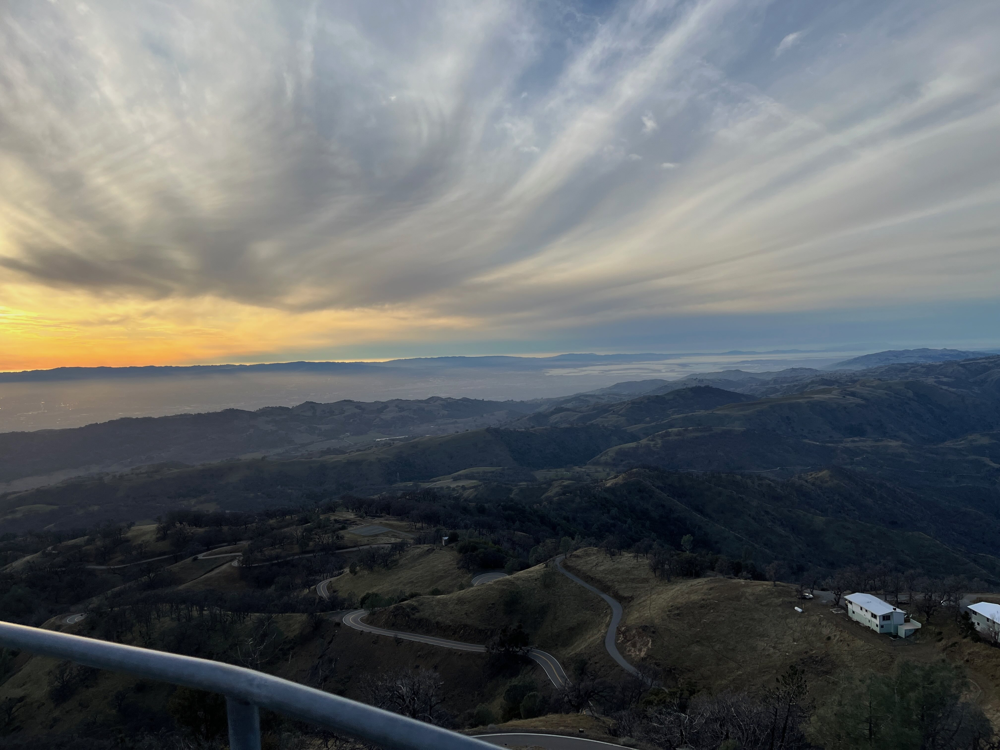

One thing that I haven’t yet mentioned in my previous posts, surprisingly, is how I love exploring geographical features on Google Earth. It fascinates me how there can be natural beauty in every place on Earth, and it has opened my eyes to the bias (unconscious or not) we have in terms of appreciating it. Sure, places like Yosemite and the Grand Canyon are beautiful, but we’ve glamourized them in a way where people feel like they’re worth visiting over other places—purely because of popularity. The truth is, natural beauty exists everywhere; we just have to learn how to appreciate it without being discouraged to do so.  

I was exploring the Diablo Range on Google Earth last week and was surprised about how unfamiliar I was with this mountain range despite its close proximity to my home in the Bay Area. It turns out that even I can be subject to the very same bias against natural beauty that I’ve convinced myself I’m against. Indeed, I’ve only realized recently that whenever I go hiking, it’s always at the Santa Cruz mountains. I never once thought of going to the Diablo Range. But who can blame me? The Santa Cruz Mountains are much more abundant with hiking trails and other recreational areas because we as a society, I guess, view coast redwoods as more “iconic” than, say, the “boring” vegetation from the Diablo Range, and in turn, inspire others, like myself, to unknowingly follow suit.  

I used this past five-day weekend as an opportunity to actually visit the Diablo Range and remove any unconscious bias I have towards it, and I must say, it was truly an awakening experience. I learned a lot about the mountain range, from how its highest peak (Mt. Hamilton) is right here in the South Bay to how vastly its vegetation varies as elevation increases. But more importantly, I learned the value there is in appreciating nature from an inclusive perspective; it creates a mindset in which you similarly cherish all the experiences of your own life, with no one component overpowering the other.  

  

Take the photo above, for example, that I took at the summit of Mt. Hamilton. Sure, there may not be any iconic coast redwoods, but the alternative—the patchy vegetation—makes the mountainous terrain more pronounced and, arguably, more beautiful. It goes to show how there is no such thing as an absence of natural beauty—how that idea is just a social construct manifested from our desires to appreciate what others appreciate. And while many would claim the patchy vegetation is “boring” (which I would argue against), the cause of the patchiness is certainly not. The Diablo Range is too far from the coast to experience regular precipitation but close enough to experience the rain shadow effect, which causes frequent disparities in dry and wet areas.  

I also like the photo because it marks my first time using low-key lighting successfully. It adds mystery to the dramatic mood that the contrast between the geometrical mountains and the freely flowing, wispy clouds helps establish.  

Also on the summit of Mt. Hamilton is Lick Observatory, and visiting it made me realize that I, and all Bay Areans for that matter, live near the presence of greatness. It turns out this observatory has done some impressive work, from playing an important role in proving Einstein’s theory of relativity to discovering Jupiter’s 5th moon—all the more reason to go visit the Diablo Range.  

The fact that Mt. Hamilton also enabled me to see the true extent of the Bay Area’s atmospheric pollution made my visit to the Diablo Range feel extra special. It felt like the universe’s way of rewarding me for trying to appreciate beauty from an inclusive perspective; had I not gone to the Diablo Range that day, I probably would have never seen just how bad the pollution really is. That’s why I like the photo below. It reflects both the beauty of the Diablo Range and the severity of the Bay Area’s atmospheric pollution—how if we don’t act now, there won’t be any natural beauty to even appreciate. The sunset is symbolic of that; it’s a reminder that the time we have to reverse the impacts of human-induced climate change is running out. The Bay Area’s pollution has gotten much worse in recent years due to a rapidly increasing amount of high-pressure systems, which, of course, are arising because of human-induced climate change. You can read more about it in my last post; it’s a problem that’s going to hurt California badly if action isn’t taken now.  

It’s generally against custom to take photos of light sources, so I’m glad the sunset turned out well. I also like the presence of the wispy clouds in this photo. Like the photo before, the clouds create contrast against the landscape, an effect that, along with the low-key lighting, helps dramatize the photo.  

  

I went to the Diablo Range to remove any unconscious bias I have towards appreciating nature, and I left with so much more. From learning about Lick Observatory to finally understanding just how polluted the Bay Area really is, I was once again reminded about the value of having an open mindset—that with it comes the power of always learning something new. Throughout my journey in environmental protection, I’ve sometimes felt that I know all there is to know, and each time, have been humbly reminded that that is simply not the case. And if I’m being honest, it’s taken me a while to fully realize that. Even at assemblies in my school, they would talk about the importance of open mindsets in promoting growth, but I would never take it to heart. So this experience of visiting the Diablo Range is very gratifying for me, and I hope that whoever is reading this learned the importance of appreciating nature from an inclusive perspective. When it becomes about what others appreciate instead, the desire to protect what you once genuinely thought of as beautiful is lost.
